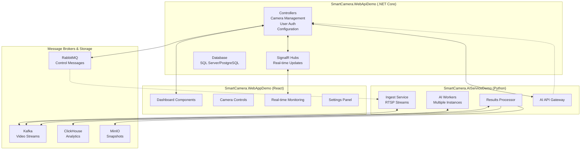

# SmartCamera.AIServiceDemo - Python AI Service

## 🏗️ Kiến trúc 3 Projects



## 📁 SmartCamera.AIServiceDemo Structure

```
SmartCamera.AIServiceDemo/
├── README.md
├── requirements.txt
├── setup.py
├── .env
├── .gitignore
├── main.py                    # Main entry point
├── docker-compose.yml         # For local development
│
├── app/
│   ├── __init__.py
│   ├── settings.py            # Configuration settings
│   ├── exceptions.py          # Custom exceptions
│   └── constants.py           # Application constants
│
├── core/
│   ├── __init__.py
│   ├── models/
│   │   ├── __init__.py
│   │   ├── camera_models.py   # Camera data models
│   │   ├── detection_models.py # AI detection models
│   │   ├── frame_models.py    # Frame/video models
│   │   └── result_models.py   # AI result models
│   ├── schemas/
│   │   ├── __init__.py
│   │   ├── api_schemas.py     # API request/response schemas
│   │   ├── message_schemas.py # Message broker schemas
│   │   └── config_schemas.py  # Configuration schemas
│   └── enums/
│       ├── __init__.py
│       ├── detection_types.py
│       ├── model_types.py
│       └── status_types.py
│
├── services/
│   ├── __init__.py
│   │
│   ├── ingest/
│   │   ├── __init__.py
│   │   ├── main.py            # Ingest service entry
│   │   ├── rtsp_handler.py    # RTSP stream handling
│   │   ├── frame_capture.py   # Frame extraction
│   │   ├── preprocessing.py   # Frame preprocessing
│   │   └── kafka_publisher.py # Send frames to Kafka
│   │
│   ├── ai_worker/
│   │   ├── __init__.py
│   │   ├── main.py            # AI Worker entry (multiple instances)
│   │   ├── inference_engine.py # Main inference logic
│   │   ├── model_loader.py    # Load/manage AI models
│   │   ├── batch_processor.py # Batch processing
│   │   ├── detectors/
│   │   │   ├── __init__.py
│   │   │   ├── base_detector.py
│   │   │   ├── yolo_detector.py    # YOLO detection
│   │   │   ├── person_detector.py  # Person detection
│   │   │   ├── face_detector.py    # Face recognition
│   │   │   ├── vehicle_detector.py # Vehicle detection
│   │   │   └── custom_detector.py  # Custom models
│   │   └── postprocessing/
│   │       ├── __init__.py
│   │       ├── nms.py         # Non-maximum suppression
│   │       ├── tracking.py    # Multi-object tracking
│   │       └── analytics.py   # Detection analytics
│   │
│   ├── results/
│   │   ├── __init__.py
│   │   ├── main.py            # Results processor entry
│   │   ├── processor.py       # Process AI results
│   │   ├── alert_engine.py    # Generate alerts
│   │   ├── enricher.py        # Enrich detection data
│   │   ├── deduplicator.py    # Remove duplicate detections
│   │   └── notifier.py        # Send notifications to WebAPI
│   │
│   └── api/
│       ├── __init__.py
│       ├── main.py            # FastAPI entry point
│       ├── routes/
│       │   ├── __init__.py
│       │   ├── health.py      # Health check
│       │   ├── inference.py   # Direct inference API
│       │   ├── models.py      # Model management
│       │   ├── metrics.py     # Performance metrics
│       │   ├── cameras.py     # Camera status from AI perspective
│       │   └── admin.py       # Admin operations
│       ├── dependencies/
│       │   ├── __init__.py
│       │   ├── auth.py        # Authentication with WebAPI
│       │   └── database.py    # Database connections
│       └── middleware/
│           ├── __init__.py
│           ├── logging.py     # Request logging
│           ├── metrics.py     # Prometheus metrics
│           └── error_handler.py
│
├── infrastructure/
│   ├── __init__.py
│   ├── messaging/
│   │   ├── __init__.py
│   │   ├── kafka/
│   │   │   ├── __init__.py
│   │   │   ├── producer.py    # Kafka producer
│   │   │   ├── consumer.py    # Kafka consumer
│   │   │   └── admin.py       # Kafka admin operations
│   │   └── rabbitmq/
│   │       ├── __init__.py
│   │       ├── publisher.py   # RabbitMQ publisher
│   │       ├── subscriber.py  # RabbitMQ subscriber
│   │       └── connection.py  # Connection management
│   ├── storage/
│   │   ├── __init__.py
│   │   ├── clickhouse/
│   │   │   ├── __init__.py
│   │   │   ├── client.py      # ClickHouse client
│   │   │   ├── models.py      # Database models
│   │   │   └── migrations.py  # Schema migrations
│   │   ├── minio/
│   │   │   ├── __init__.py
│   │   │   ├── client.py      # MinIO client
│   │   │   └── utils.py       # Upload/download utilities
│   │   └── redis/
│   │       ├── __init__.py
│   │       ├── client.py      # Redis client
│   │       └── cache.py       # Caching utilities
│   ├── external/
│   │   ├── __init__.py
│   │   ├── webapi_client.py   # Client for SmartCamera.WebApiDemo
│   │   └── triton_client.py   # Triton Inference Server client
│   └── monitoring/
│       ├── __init__.py
│       ├── metrics.py         # Prometheus metrics
│       ├── health_check.py    # Health monitoring
│       └── logging.py         # Structured logging
│
├── shared/
│   ├── __init__.py
│   ├── utils/
│   │   ├── __init__.py
│   │   ├── image_utils.py     # Image processing utilities
│   │   ├── video_utils.py     # Video processing utilities
│   │   ├── math_utils.py      # Mathematical operations
│   │   ├── datetime_utils.py  # Date/time utilities
│   │   └── validation.py      # Data validation
│   ├── decorators/
│   │   ├── __init__.py
│   │   ├── retry.py           # Retry mechanism
│   │   ├── timing.py          # Performance timing
│   │   ├── cache.py           # Caching decorator
│   │   └── error_handling.py  # Error handling
│   └── config/
│       ├── __init__.py
│       ├── kafka_topics.py    # Kafka topic definitions
│       ├── model_configs.py   # AI model configurations
│       └── logging_config.py  # Logging configuration
│
├── tests/
│   ├── __init__.py
│   ├── conftest.py           # Pytest configuration
│   ├── fixtures/
│   │   ├── __init__.py
│   │   ├── sample_data.py    # Test data fixtures
│   │   ├── mock_streams.py   # Mock RTSP streams
│   │   └── test_images.py    # Test images
│   ├── unit/
│   │   ├── __init__.py
│   │   ├── test_detectors.py # Unit tests for detectors
│   │   ├── test_processors.py # Unit tests for processors
│   │   ├── test_utils.py     # Unit tests for utilities
│   │   └── test_models.py    # Unit tests for models
│   ├── integration/
│   │   ├── __init__.py
│   │   ├── test_kafka_flow.py # Test Kafka integration
│   │   ├── test_storage.py   # Test storage integration
│   │   ├── test_webapi_integration.py # Test WebAPI integration
│   │   └── test_full_pipeline.py # End-to-end tests
│   └── performance/
│       ├── __init__.py
│       ├── test_inference_speed.py # Inference performance
│       ├── test_memory_usage.py    # Memory usage tests
│       └── load_testing.py         # Load testing
│
├── scripts/
│   ├── __init__.py
│   ├── setup/
│   │   ├── __init__.py
│   │   ├── setup_kafka_topics.py  # Create Kafka topics
│   │   ├── setup_clickhouse.py    # Setup ClickHouse schema
│   │   ├── download_models.py     # Download AI models
│   │   └── setup_minio_buckets.py # Create MinIO buckets
│   ├── deployment/
│   │   ├── __init__.py
│   │   ├── start_services.py      # Start all services
│   │   ├── stop_services.py       # Stop all services
│   │   ├── restart_workers.py     # Restart AI workers
│   │   └── health_check.py        # System health check
│   ├── development/
│   │   ├── __init__.py
│   │   ├── mock_rtsp_server.py    # Mock RTSP streams for testing
│   │   ├── generate_test_data.py  # Generate test data
│   │   └── performance_monitor.py # Monitor system performance
│   └── maintenance/
│       ├── __init__.py
│       ├── cleanup_old_data.py    # Clean old data
│       ├── model_updater.py       # Update AI models
│       └── backup_restore.py      # Backup/restore utilities
│
├── models/                   # AI model files
│   ├── yolo/
│   │   ├── yolov8n.pt
│   │   ├── yolov8s.pt
│   │   └── yolov8m.pt
│   ├── face_recognition/
│   │   └── facenet_model.pb
│   ├── person_detection/
│   │   └── person_detector.tflite
│   └── custom/
│       └── custom_model.onnx
│
├── data/
│   ├── samples/              # Sample images/videos for testing
│   ├── configs/              # Configuration files
│   └── logs/                 # Application logs
│
├── deploy/
│   ├── docker/
│   │   ├── Dockerfile.ingest
│   │   ├── Dockerfile.worker
│   │   ├── Dockerfile.results
│   │   └── Dockerfile.api
│   ├── k8s/                  # Kubernetes manifests
│   │   ├── namespace.yaml
│   │   ├── configmap.yaml
│   │   ├── deployment.yaml
│   │   └── service.yaml
│   ├── systemd/              # Systemd service files
│   │   ├── smartcamera-ingest.service
│   │   ├── smartcamera-worker@.service
│   │   ├── smartcamera-results.service
│   │   └── smartcamera-api.service
│   └── monitoring/
│       ├── prometheus.yml
│       ├── grafana-dashboard.json
│       └── alerting-rules.yml
│
└── docs/
    ├── README.md
    ├── API.md                # API documentation
    ├── DEPLOYMENT.md         # Deployment guide
    ├── INTEGRATION.md        # Integration with WebAPI/WebApp
    ├── PERFORMANCE.md        # Performance tuning
    └── examples/
        ├── basic_usage.py
        ├── custom_detector.py
        └── api_client_example.py
```

## 🚀 Entry Points & Services

### Main Services
```bash
# Start individual services
python -m services.ingest.main          # RTSP Ingestion Service
python -m services.ai_worker.main       # AI Worker (can run multiple instances)
python -m services.results.main         # Results Processing Service  
python -m services.api.main             # FastAPI Gateway

# Start all services at once
python scripts/deployment/start_services.py

# Setup infrastructure
python scripts/setup/setup_kafka_topics.py
python scripts/setup/setup_clickhouse.py
python scripts/setup/download_models.py
```

### Integration với WebApiDemo
```python
# infrastructure/external/webapi_client.py
class WebApiClient:
    def __init__(self, base_url: str, api_key: str):
        self.base_url = base_url  # SmartCamera.WebApiDemo URL
        self.api_key = api_key
    
    async def send_detection_results(self, camera_id: str, results: List[Detection]):
        """Send AI detection results to WebAPI"""
        pass
    
    async def update_camera_ai_status(self, camera_id: str, status: dict):
        """Update camera AI processing status"""
        pass
    
    async def get_camera_configuration(self, camera_id: str):
        """Get camera config from WebAPI"""
        pass
```

## 🔄 Data Flow

```
WebApiDemo → RabbitMQ → AIServiceDemo (Ingest)
                              ↓
                         Kafka (frames)
                              ↓
                        AI Workers (multiple instances)
                              ↓
                         Kafka (results)
                              ↓
                        Results Processor
                              ↓
                    ClickHouse + MinIO + WebApiDemo
                              ↓
                         WebAppDemo (UI)
```

Bạn muốn tôi implement component nào trước trong **SmartCamera.AIServiceDemo**?

1. **WebAPI Integration** - Kết nối với SmartCamera.WebApiDemo
2. **RTSP Ingest Service** - Thu thập video streams
3. **AI Worker** - Core inference engine
4. **Results Processor** - Xử lý kết quả AI
5. **Setup Scripts** - Bootstrap toàn bộ hệ thống